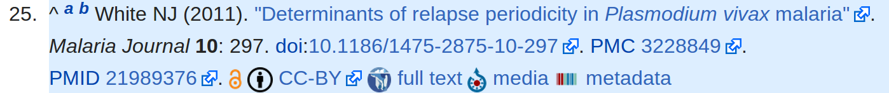
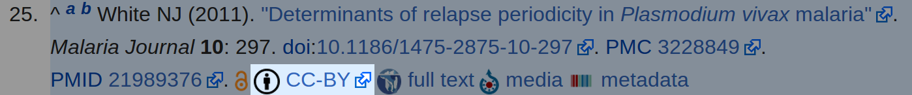
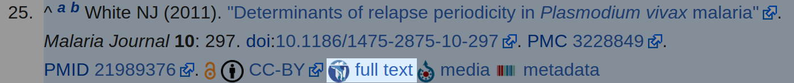
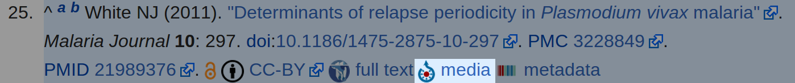
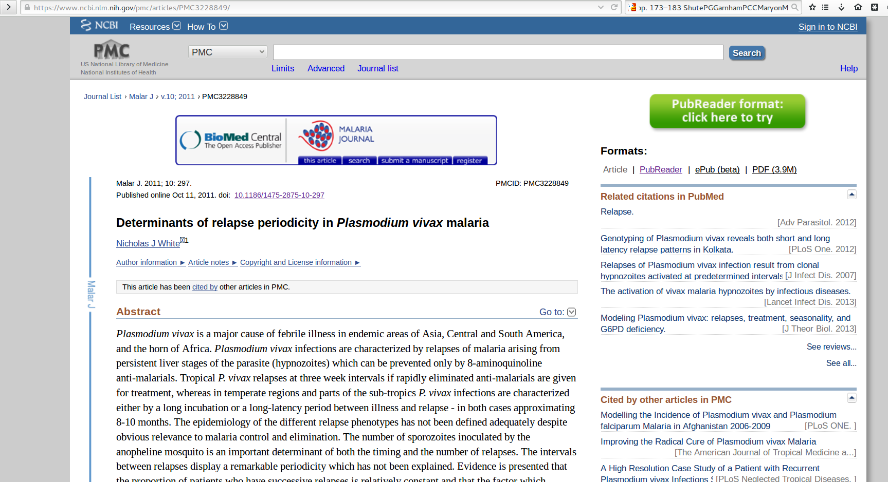
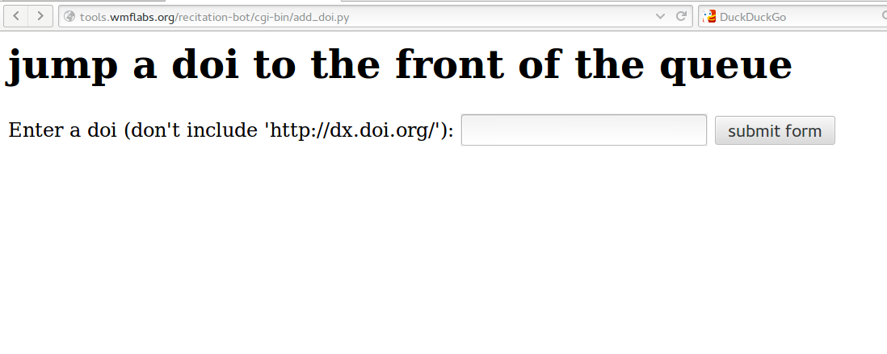
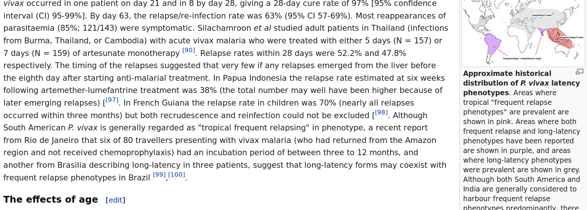

#SALVE SAND AND RE-CITE-WORLD
##(Anagram of Alice's Adventure in Wonderland)

#The story begins:

#Actually it's a rehashing and remixing of older stories

#This particular source parody has many chapers

#It's Free To Read
+ Like Alices 

#It has a License
+ It's CC-BY, which Carol no longer insists on

#You can read it on Wikisource
+ This is important for "deep-liking"
+ And Wikipedia-Zero Programs

#And for those who like to argue Semantics
+Wikidata can keep article usage statistics easily

#The Rabbit Hole PMC
+ So we first travel to a foreign land

#Enter the Rabbit Hole
#Wikidata
+ We made a web-tool where you can thrown a DOI

#The Rabbit Hole
+ The cakes we find there are expanding XML representations

#Tranforming To Get Through The Doorway
+ JATS-to-Mediawiki converts to Wikitext [https://github.com/wpoa/JATS-to-Mediawiki](github link)
+ Thanks [https://github.com/Klortho](Klortho)

#Wikisource
blockquote: "They're dreadfully fond of beheading people here; the great wonder is, that there's any one left alive!" (Joke - our bot was blocked)

#Wikisource
blockquote: 'I can't explain myself, I'm afraid, sir' said Alice, 'because I'm not myself, you see.'

#Wikisource
+ In fact we can makes sure we can always explain ourselves. A way to prevent link rot, is to host ourselves.
+ 6 years is the average lifespan of a URL (according to Crossref)

#Wikisource
+And we can also handle the images of the articles:

#Commons
blockquote: Alice waited till the eyes appeared, and then nodded. 'It's no use speaking to it,' she thought, 'till its ears have come, or at least one of them.'

#Commons
+ All the parts of the Cheshire catare always displayed in full.
+ It's always fun to see what you get. (Check my twitter for Peruvian Frogs)

#Wikidata
blockqoute: "The chief difficulty Alice found at first was in managing her flamingo"

#Wikidata
+ Thankfully we made our own flamingo manager

#Wikidata
+ A semantic flamingo manager

#Wikidata
+ A hyperlinked flamingo universe
+ Publishers and statisician will love this

